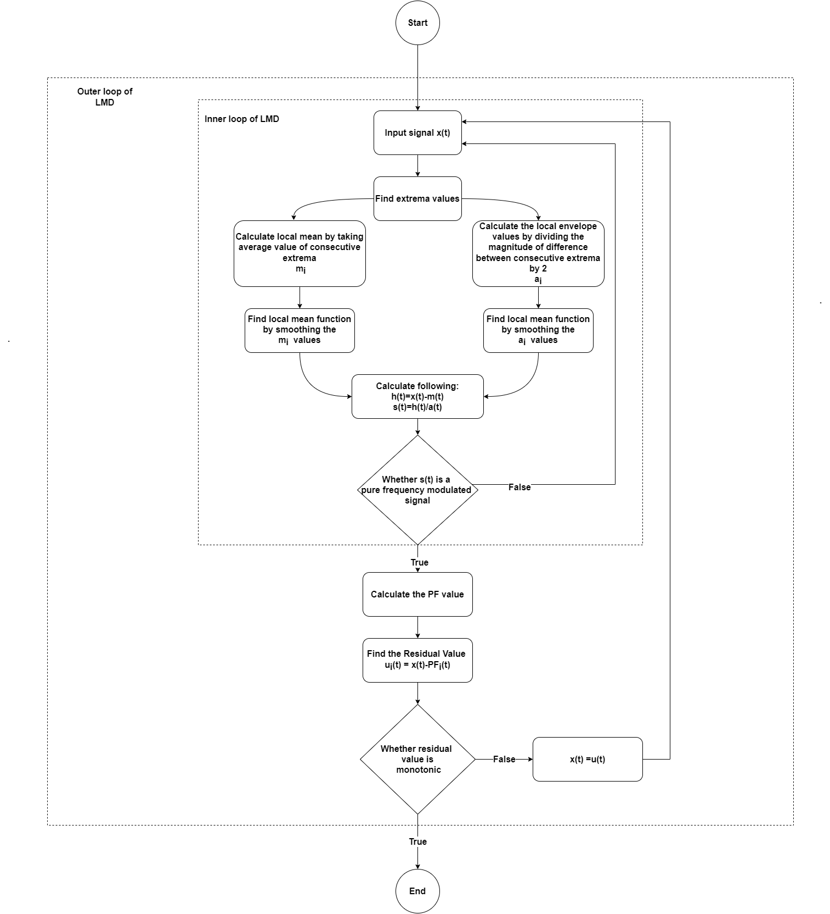
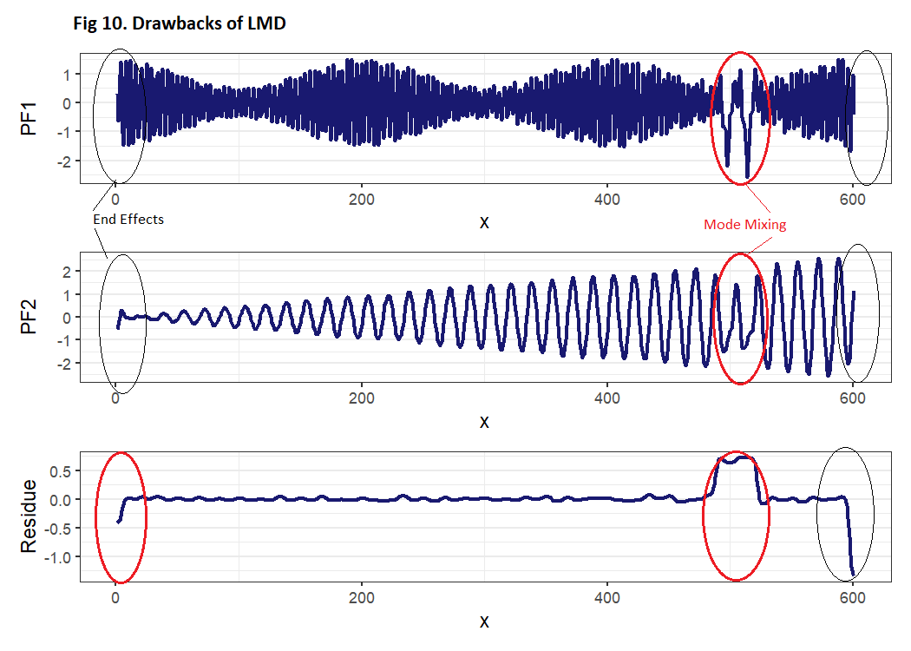

```{r, include = FALSE}
knitr::opts_chunk$set(collapse = TRUE,
                      comment = "#>")
```

```{r setup, warning = FALSE, include = FALSE}
knitr::opts_chunk$set(
  collapse = TRUE,
  comment = "#>",
  out.width = "672px",
  out.height = "480px",
  fig.width = 7,
  fig.height = 5,
  fig.align = "center",
  fig.retina = 1,
  dpi = 150
)

library("ggplot2")
library("rmarkdown")
library("knitr")
library("ggformula")
library("patchwork")
library( "LMD")

# # installing all required packages
# list.of.packages <- c("ggplot2",
#                       "rmarkdown",
#                       "knitr",
#                       "ggformula",
#                       "patchwork",
#                       "LMD")
# 
# new.packages <-
#   list.of.packages[!(list.of.packages %in% installed.packages()[, "Package"])]
# if (length(new.packages))
#   install.packages(new.packages, dependencies = TRUE)
# 
# # Loading the required libraries
# lapply(list.of.packages, library, character.only = T)


options(expressions = 10000)

```

# Abstract

::: {style="text-align: justify"}
The R package LMD is introduced in this work, which is based on local mean decomposition, an iterative and self-adaptive approach for demodulating, processing, and analyzing multi-component amplitude-modulated (AM) and frequency modulated (FM) signals. Any complex signal can be decomposed into product functions (PFs) using LMD, where each PF is the product of an envelope signal and a purely frequency modulated signal (FM). The LMD method can be used to a broad variety of natural signals, including electrocardiograms and seismic data. In addition, because equipment fault vibration signals are frequently multi-component modulation signals, LMD may be used to identify faults in gears, roller bearings, and other rotating machinery. The LMD package includes utilities for calculating extreme points and moving averages. LMD as a package includes functions for finding extreme points, moving average smoothing, checking monotonicity, extracting mean and envelope signals, extracting product functions and graphical display of results. In this vignette we will cover the mentioned functions for experimental analysis of a simulated signal to show the validity of the LMD method.
:::

<br>

# Introduction

::: {style="text-align: justify"}
Rotating machines are widely used in many sectors and are susceptible to a wide range of failures, particularly when working in tough and time-varying situations. Early discovery of these faults is critical; otherwise, they may result in significant economic loss, if not a catastrophe. As a result, the development of effective defect diagnostic techniques is critical for safety and improved maintenance decision making in rotating equipment applications. There are many feature extraction techniques available today for the detection of rotating machinery faults, such as frequency/spectrum analysis, time/statistical analysis, time-frequency analysis, and so on. However, the approaches described above are only applicable to mono-component modulation signals, and also do not perform well for non-stationary signals.<br>   Signals acquired from machines not only have the frequency of the machine component of interest, but also interference frequencies from other neighboring components and environmental disturbances. The phenomena of amplitude modulation, frequency modulation, and phase modulation are also frequent in these signals. Furthermore, rotating machines frequently operate under time-varying speed and load circumstances, causing the signals obtained from them to be non-linear. If a failure starts developing in these machines, the fault signature is difficult to identify owing to the interferences indicated above.<br>   Adaptive mode decomposition approaches work well with non-stationary time series data. These procedures do not need any prior understanding of the signals and are good in capturing the local features of a signal, such as malfunction indication. LMD is also an adaptive technique that can decompose a complex multi-component signal into a series of product functions (PFs) on its own.
:::

<br>

# LMD

::: {style="text-align: justify"}
A multi-component signal can be broken down into its constituent PFs and a residue. Each PF is a mono component that is the result of an envelope signal and a frequency modulated signal. In LMD a two-tier method is utilized to perform the demodulation .First, the inner cycle is used to conduct a thorough computation of the PF. Second, in the outer cycle, the signal is decomposed depending on the iterations. In the following sections the methods have been broken down into steps that LMD technique requires to complete the analysis on a given signal x(t). Consider the following synthetic signal $x (t)$ of the form :
:::

<br>

$$x ( t ) = 0.25t + sin ( πt ) + sin ( 2πt ) + sin ( 6πt )$$

The above signal is represented in graphical form below:

```{r,echo=TRUE,message=FALSE,warning=FALSE}

fs <- 2000 #Sampling Frequency
time_component <- seq(from = 0, to = 9, by = 1 / fs)
# Simulated Signal
signal <- (0.25 * time_component + sin(pi * time_component) + sin(2 * pi * time_component) +
      sin(6 * pi * time_component))

dummy_df <- data.frame(Time = time_component, Value = signal)

p1 <- ggplot(dummy_df) +
  aes(x = Time, y = Value) +
  geom_spline(size = 2, colour = "#1D2B71") +
  scale_color_hue() +
  labs(title = "Fig 1. Sample Signal") +
  theme_minimal() +
  theme(legend.position = "none")

plot(p1)

```

## Steps for PF Extraction

### Step 1

In the first step, all the local extrema $n_i$ are extracted from the original signal $x(t)$. The extreme values of a signal can be found out by using the `find_extrema` function from LMD.

    LMD::find_extrema(signal)

`find_extrema` function expects following parameters:

-   `signal`: Signal is a vector of numeric values
-   `include_endpoints`: A logical value indicating whether to include end points or not. Default value for this is set to TRUE.

The function returns indexes of all extreme values. In the below chunk the extreme values of the original sample signal x(t) have been indicated by red color.

```{r,echo=TRUE,message=FALSE,warning=FALSE}

extreme_values <- LMD::find_extrema(signal)

p2 <- ggplot() +
  geom_spline(
    data = dummy_df,
    aes(x = Time, y = Value),
    size = 2,
    colour = "#1D2B71"
  ) +
  geom_point(aes(x = dummy_df$Time[extreme_values], y = dummy_df$Value[extreme_values]),
             size = 5,
             colour = "red") +
  scale_color_hue() +
  labs(title = "Fig 2. Sifting Process: (1)") +
  theme_minimal() +
  theme(legend.position = "none")

plot(p2)
```

### Step 2

In the second step the mean value $m_i$ is calculated by taking average of the current extrema $n_i$ and the next extrema $n_{i+1}$. So the $i_{th}$ mean value $m_i$ of each two successive extrema $n_i$ and $n_{i+1}$ is given by:

$$ \begin{aligned} &m_i = {\frac{n_i+n_{i+1}}{2}} \\ 
 \end{aligned} $$

All the mean values $m_i$ of two successive extreme are connected by straight lines, as shown below:

```{r,echo=TRUE,message=FALSE,warning=FALSE}

extreme_values <- LMD::find_extrema(signal)
ma_enve = local_mean_and_envelope(signal, extreme_values)
mean = ma_enve$mean

p3 <- ggplot() +
  geom_spline(
    data = dummy_df,
    aes(x = Time, y = Value),
    size = 2,
    colour = "#1D2B71",
    alpha = 0.5
  ) +
  geom_point(
    aes(x = dummy_df$Time[extreme_values], y = dummy_df$Value[extreme_values]),
    size = 5,
    colour = "red",
    alpha = 0.5
  ) +
  geom_line(aes(x = dummy_df$Time, y = mean),
            size = 1,
            colour = "red") +
  scale_color_hue() +
  labs(title = "Fig 3. Sifting Process: (2.1)") +
  theme_minimal() +
  theme(legend.position = "none")

plot(p3)
```

The local mean function $m_{11}(t)$ is derived by taking a moving weighted average of the means $m_i$.

```{r,echo=TRUE,message=FALSE,warning=FALSE}

ma = ma_enve$ma

p4 <- ggplot() +
  geom_spline(
    data = dummy_df,
    aes(x = Time, y = Value),
    size = 2,
    colour = "#1D2B71",
    alpha = 0.5
  ) +
  geom_point(
    aes(x = dummy_df$Time[extreme_values], y = dummy_df$Value[extreme_values]),
    size = 5,
    colour = "red",
    alpha = 0.5
  ) +
  geom_line(aes(x = dummy_df$Time, y = ma),
            size = 1,
            colour = "red") +
  scale_color_hue() +
  labs(title = "Fig 4. Sifting Process: (2.2) ") +
  theme_minimal() +
  theme(legend.position = "none")

plot(p4)
```

Similarly the envelope value$a_i$ is given by:

$$ \begin{aligned} &a_i = {\frac{|n_i-n_{i+1}|}{2}} \\ 
 \end{aligned} $$

```{r,echo=TRUE,message=FALSE,warning=FALSE}

envelope = ma_enve$enve
Time=dummy_df$Time

p5 <- ggplot() +
  geom_line(aes(x = Time, y = envelope),
            size = 1,
            colour = "red") +
  scale_color_hue() +
  labs(title = "Fig 5. Sifting Process: (2.3)") +
  theme_minimal() +
  theme(legend.position = "none")

plot(p5)
```

The envelope values $a_i$ are smoothed using weighted moving average and the envelope function $a_{11}$(t) is formed.

```{r,echo=TRUE,message=FALSE,warning=FALSE}

enve_sm = ma_enve$enve_sm
Time=dummy_df$Time
p6 <- ggplot() +  
  geom_line(aes(x = Time, y = envelope),
            size = 0.5,
            colour = "red",alpha=0.5) +
  geom_line(aes(x = Time, y = enve_sm),
            size = 1,
            colour = "red") +
  scale_color_hue() +
  labs(title = "Fig 6. Sifting Process: (2.4) ") +
  theme_minimal() +
  theme(legend.position = "none")

plot(p6)
```

The local mean and envelope and corresponding smoothed values can be found out by using the `local_mean_and_envelope` function from LMD.

    LMD::local_mean_and_envelope(signal, extrema)

`local_mean_and_envelope` function expects following parameters:

-   `signal`: Signal is a vector of numeric values
-   `extrema`: A vector of numeric values for indexes for extreme values in the signal

The function returns local mean, moving averaged local mean, envelope and moving averaged local envelope values.

### Step 3

In the step 3 we calculate the zero-mean signal $h_{11}$(t) by taking a difference of the original signal $x(t)$ and the local mean function $m_{11}$(t) :

$$ \begin{aligned} &h_{11}(t) = {x(t)-m_{11}(t)} \\ 
 \end{aligned} $$

### Step 4

Then, a frequency modulated signal $s_{11}$(t) is calculated  as:

$$ \begin{aligned} &s_{11}(t) = {h_{11}(t)/a_{11}(t)} \\ 
 \end{aligned}  $$

### Step 5

Repeat the above steps 1 to 3 to get the envelope value $a_{12}$(t) of $s_{11}$(t) . This is the checkpoint for the inner loop, if this  envelope function $a_{12}$(t) is equal to 1, the inner iteration is stopped and $s_{12}$(t) is considered as the first purely frequency modulated (FM) signal. Else, the $s_{11}$(t) is considered as the original signal and Steps 1 to 4 are repeated n times until the condition $a_{1(n+1)}$(t)=1 is satisfied for signal $s_{1(n)}$(t).

### Step 6

Calculate the envelope signal $a_1$(t) of the first PF1 , multiply all the smoothed local envelopes from the iterations:

$$ \begin{aligned} & a_1(t) = a_{11}(t) * a_{12}(t)*a_{13}(t)\dotso a_{1n}(t)  \\ 
 \end{aligned} $$

### Step 7

Compute the first $PF_1$ using $a_{1}(t)$ and $s_{1n}(t)$:

$$\begin{aligned} & PF_1 = a_{1}(t)s_{1n}(t)  \\ 
 \end{aligned} $$

Now the residual signal is given by $u_1(t)$ = $x(t)$-$PF_1(t)$ . The residual $u_1(t)$ is considered as the original signal and the above steps are repeated n times until $u_n(t)$ does not contain oscillation.

This is the called outer loop of LMD. Finally, the signal x(n) is represented as a sum of PFs and residual signal:

$$\begin{aligned} & x(n) = \sum^q_{i=1}PF_i(n)+u_q(n)  \\ 
 \end{aligned} $$

The LMD method can be applied on a signal by using the `lmd` function from LMD Package.

    LMD::lmd(signal)

`lmd` function expects following parameters:

-   `signal`: Signal is a vector of numeric values
-   `include_endpoints`: A boolean value indicating whether to treat the endpoint of the signal as a pseudo-extreme point
-   `max_smooth_iteration`: An integer value for maximum number of iterations of moving average algorithm
-   `max_envelope_iteration`: An integer value for maximum number of iterations when separating local envelope signals
-   `envelope_epsilon`: A float value to terminate processing when obtaining pure FM signal
-   `convergence_epsilon`: A float value to terminate processing when modulation signal converges
-   `max_num_pf`: An integer value for maximum number of PFs to be generated

The function returns PF and residual value as a list.

## Flowchart of LMD

A flowchart of the LMD method is presented in figure below for better understanding. <br>

{width="700"}

<br>

# Analysis of a simulated signal

In this section we will take a simulated multi-component AM--FM signal x(t) and apply the LMD method on it. The time duration of the signal is 600s with sampling frequency of 1 Hz.

$$ \begin{align*} 
x(t) &= x_1(t) + x_2(t) \\
x_1(t) &= [(1+0.5cos(πt/100))](cos(πt/2+2cos(πt/50))) \\
x_2(t) &= 4sin(πt/2500)sin(6πt/50) \end{align*} $$

The plot below shows the time domain waveform for $x(t)$, $x_1(t)$ and $x_2(t)$ respectively.

```{r}
t=0:600
x1=(1+0.5*cos(pi*t/100))*(cos(pi*t/2+2*cos(pi*t/50)))
x2=4*sin(pi*t/2500)*sin(6*pi*t/50)
y=x1+x2

Time=t
combined_signal=y

p7 <- ggplot() +
  ggplot2::geom_line(aes(x = Time, y = combined_signal),
                     size = 1,
                     colour = "midnightblue") +
  ggplot2::ylab("Combined Signal x(t)") + 
  ggplot2::theme_bw() +
  ggplot2::theme(
    panel.border = ggplot2::element_rect(size = 0.1),
    legend.position = c(0.8, 0.8),
    panel.grid.major.x = ggplot2::element_blank()
  )

p8 <- ggplot() +
  ggplot2::geom_line(aes(x = Time, y = x1),
                     size = 1,
                     colour = "midnightblue") +
  ggplot2::ylab("x1(t)") + 
  ggplot2::theme_bw() +
  ggplot2::theme(
    panel.border = ggplot2::element_rect(size = 0.1),
    legend.position = c(0.8, 0.8),
    panel.grid.major.x = ggplot2::element_blank()
  )

p9 <- ggplot() +
  ggplot2::geom_line(aes(x = Time, y = x2),
                     size = 1,
                     colour = "midnightblue") +
  ggplot2::ylab("x2(t)") + 
  ggplot2::theme_bw() +
  ggplot2::theme(
    panel.border = ggplot2::element_rect(size = 0.1),
    legend.position = c(0.8, 0.8),
    panel.grid.major.x = ggplot2::element_blank()
  )

print((p7/p8/p9)+ 
    plot_annotation(title = "Fig 8. Simulated Signal"))

```

`lmd` function is applied to decompose the simulation signal x(t) by selecting `max_num_pf` as 2.

```{r}
lmd_object=LMD::lmd(combined_signal,max_num_pf=2)
PF1=lmd_object[["pf"]][[1]]
PF2=lmd_object[["pf"]][[2]]
residual_signal=lmd_object[["residue"]]


```

The decomposition results are presented in plot below using `plot_lmd` function. `plot_lmd` function expects following parameters:

-   `lmd_obj`: LMD object created from LMD function
-   `max_pf`: Number of PFs to Plot
-   `show_residue`: Whether to plot residue signal or not
-   `pricolor_plot`: Line color for plots
-   `line_size_plot`: Size of line in ggplot

The function returns a combined plot for PF and residual values.

```{r}
plot_lmd(lmd_object)+ 
    plot_annotation(title = "Fig 9. LMD Decompsition of Simulated Signal")
```

In the plot above the product functions and the residual signal obtained by decomposition of original signal is shown. The first product function PF1(t) corresponds to constituent x1(t) and second product function PF2 is the signal close to original constituent x2(t). PF1(t) and PF2(t) are very close and similar to x1(t) and x2(t), respectively. However, the residue signal contains some abnormal peaks, and the corresponding disturbances can be seen in PFs as well, which shows that the demodulation is close but not perfect. In the next section we address these imperfections.

# Drawbacks of LMD

LMD shows great capability in demodulating amplitude and frequency modulated signals. Be that as it may, it is noticeably flawed. It has inadequacies, namely end effects and mode mixing. For better understanding, these imperfections have been highlighted in the plot that we received in above step(Fig 9). In Fig. 10, if we look closely at the ends of residual signal, we can notice the first and the last value deviating a lot from the rest of the signal, this effect is visible in PFs also. This peculiarity is known as the end effect of LMD. Furthermore, we can see some more deviations at around 500 s. This is called mode mixing of LMD.  ***To mitigate these issues, several variations of LMD (like RLMD,IELMD,OLMD etc) have been proposed by researchers, however, these methods have not been included in this package.***

{width="700"}

<br>

# Applications

-   Fault diagnosis for rotating machinery
-   Decomposition of EEG Signal

# References

-   D. Kim and H.-S. Oh, "EMD: A package for empirical mode decomposition and Hilbert spectrum," The R Journal, 01-Jun-2009. [Online]. Available: <https://journal.r-project.org/articles/RJ-2009-002/>. [Accessed: 17-Sep-2022]. J. Cheng, Y. Yang, and Y. Yang, "A rotating machinery fault diagnosis method based on local mean decomposition," Digital Signal Processing, 19-Oct-2011. [Online]. Available: <https://www.sciencedirect.com/science/article/pii/S1051200411001448>. [Accessed: 17-Sep-2022].
-   "Review of local mean decomposition and its application in fault diagnosis of rotating machinery," IEEE Xplore. [Online]. Available: <https://ieeexplore.ieee.org/document/8820748>. [Accessed: 17-Sep-2022].
-   Y. Li, M. Xu, Z. Haiyang, Y. Wei, and W. Huang, "A new rotating machinery fault diagnosis method based on improved local mean decomposition," Digital Signal Processing, 08-Jul-2015. [Online]. Available: <https://www.sciencedirect.com/science/article/pii/S1051200415002213>. [Accessed: 17-Sep-2022].
-   Z. Liu, Y. Jin, M. J. Zuo, and Z. Feng, "Time-frequency representation based on robust local mean decomposition for multicomponent AM-FM signal analysis," Mechanical Systems and Signal Processing, 10-Apr-2017. [Online]. Available: <https://www.sciencedirect.com/science/article/pii/S0888327017301619>. [Accessed: 17-Sep-2022].
